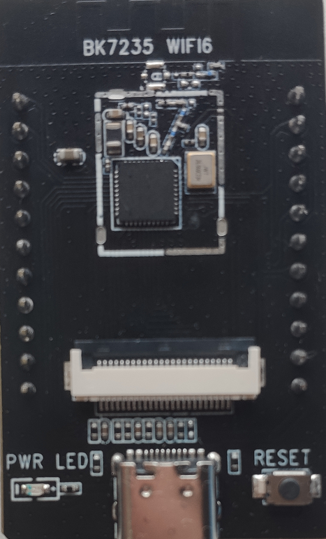
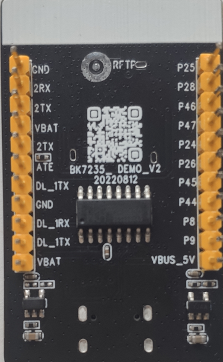
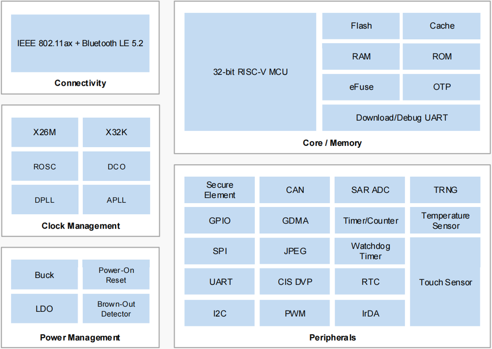

# device_board_beken

  - [介绍](#介绍)
  - [芯片框图](#芯片框图)
  - [BK7235开发板特性](#BK7235开发板特性)
  - [软件架构](#软件架构)
  - [环境搭建](#环境搭建)
  - [相关仓](#相关仓)

## 介绍

BK7235是博通集成（BEKEN）研发的一款针对IoT应用、高度集成的WiFi6+BLE 5.2 combo SOC，具有资源丰富、性能强大、更高的安全性等特点。

BK7235开发板包含以下几个部分：

>	BK7235核心板，包含匹配电路、滤波电路及晶振电路

>	CIS DVP interface

>	电源指示灯

>	烧录及日志接口

>	复位按键

开发板正面图如下



开发板反面图如下



利用BK7235开发板，用户即可快速进行产品开发。

## 芯片框图



## BK7235开发板特性

1. BK7235基于WiFi6的设计，有更省电、抗干扰能力强、数据传输效率高等特点。
2. BK7235集成了高性能的32-bit RISC-V MCU，主频高达320MHz，集成FPU、MPU并支持DSP指令。EEMBC CoreMark跑分高达3.57 CoreMark/MHz。
3. BK7235片上集成了 4MByte Flash、512KByte SRAM、64KByte ROM、32Byte Efuse以及8Kbit OTP，并且可选4MByte PSRAM的配置。
4. BK7235支持Secure boot及多种硬件加密引擎，并且已经通过了PSA Certified Level 1安全认证。
5. BK7235拥有I2C、SPI、PWM、CAN、IrDA、TOUCH、SARADC、UART、JPEG encoder/decoder 、DVP camera interface等丰富的外设。
6. BK7235支持2.7V~5V宽电压供电，适合家电类应用。
7. BK7235可以工作在-40℃~+125℃的温度范围，适合灯具及户外等应用。

## 软件架构

```
/device/board/beken/		
├── bk7235x			
├── figures			
├── shields
├── BUILD.gn
├── Kconfig.liteos_m.boards
├── Kconfig.liteos_m.defconfig.boards
└── Kconfig.liteos_m.shields
```

## 环境搭建

参考[环境搭建](https://gitee.com/openharmony-sig/device_soc_beken#编译环境搭建)

## 相关仓

[vendor](https://gitee.com/openharmony-sig/vendor_beken)

[soc](https://gitee.com/openharmony-sig/device_soc_beken)
